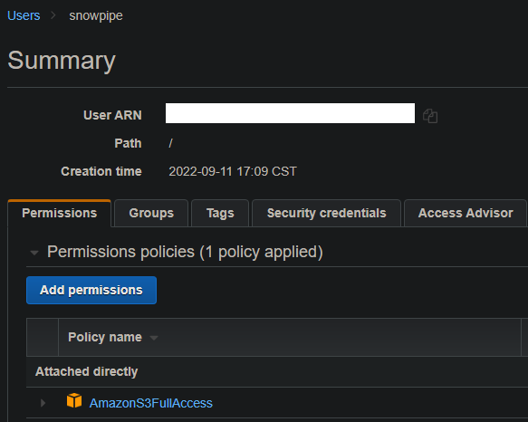

# AWS Lambda + Snowpipe ETL

The pipeline's logic is as follows:

1. A csv file is uploaded to an S3 bucket.

2. A lambda function will be triggered.

3. The function will extract the csv data into a pandas dataframe, then transform and load it in another S3 bucket.

4. This in turn will trigger a Snowpipe. 

5. The snowpipe will automatically load this data into a table. 

Acomplishing this takes a bit of set up. Let's start by creating a new user and a policy to let Snowflake access our S3 buckets:

Then create the S3 buckets in question:

* One for the external stage.
* One to store the lambda function's code and python dependencies (optional).
* One for the source data.

Here i've chosen central Canada as my region since that's where my Snowflake account lives.

The next step is to create our Lambda function, making sure to select "All objects create events" as our Event type and the source bucket as our Trigger:

With this done, let's switch to Snowflake and create the relevant objects (dark theme courtesy of the [Dark Reader plug-in](https://darkreader.org/) for Chrome):

Create Database and table       |  Create file format and external stage                   |  Create snowpipe
:-------------------------:|:-------------------------:|:-------------------------:
|  | 

Important to note that I'm not directly writing my AWS credentials but using a Snowflake storage integration object instead, which considerably more safe. Another important point is that I later modified the url to be just "s3:\\kevininidestination" since it's easier without a folder.

Coming back to AWS, let's create an event notification inside the destination bucket/external stage so that it triggers the snowpipe once data is present:

Now everything is in place for us to start working on the code for the lambda function. The faster way of going about it (afaik) is to write it in the console provided by AWS and use a Snowflake connector, then add klayers as needed. I want to make life a bit harder so I'm doing neither.

The function should look something like this:

After that, we can use Windows subsystem for Linux to install Python3 + relevant libraries in the same place our function.py was saved to, then use 7-zip or something similar to bundle everything up, upload it to the lambdazip bucket and import it as our function.

Supposing everything went right first time, we can now upload a csv file to the source bucket and watch our little pipeline in action (moving the data from the stage into the table might take a bit). As you might've guess already, I'm gonna be using the popular Iris data set for this.

The final result should look something like this:

